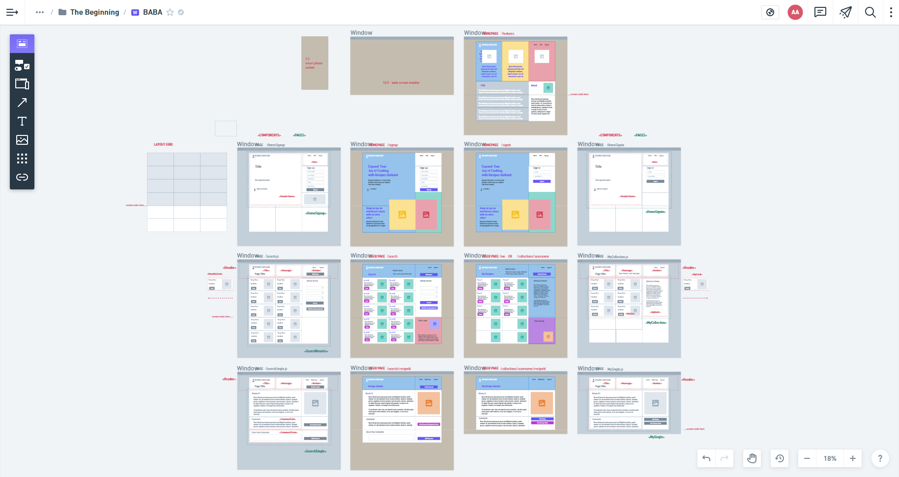
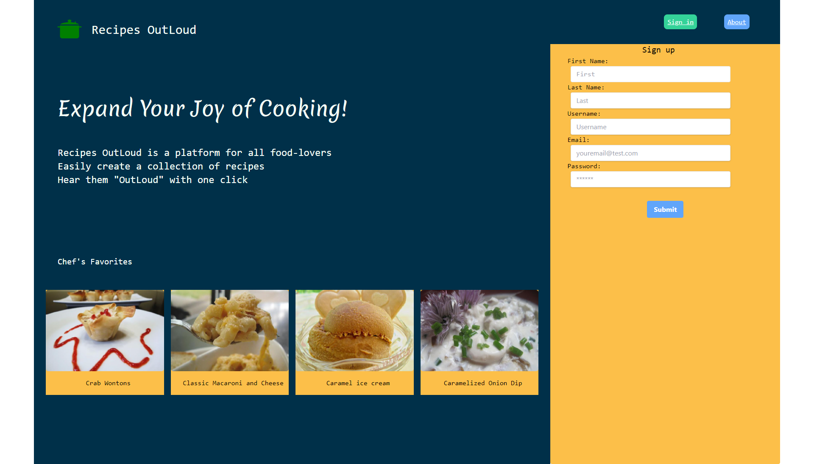
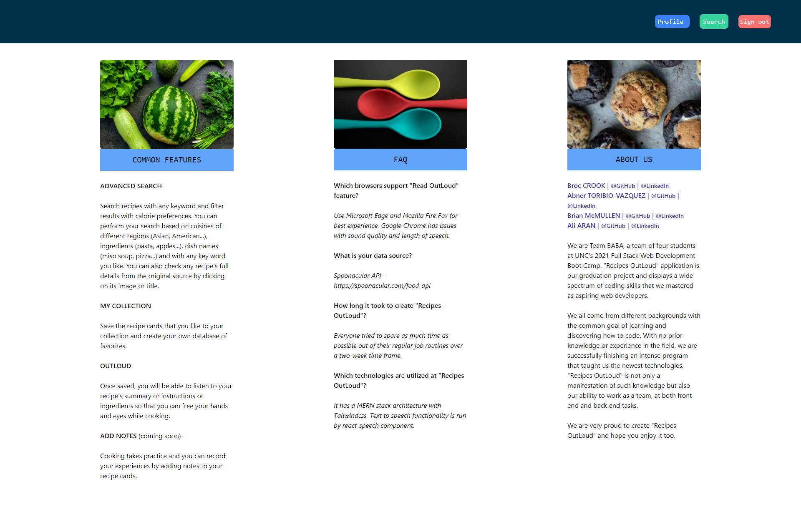
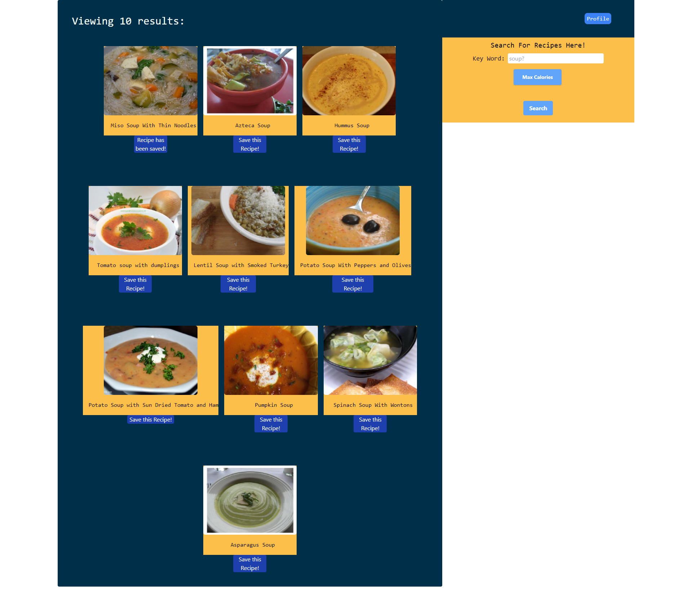
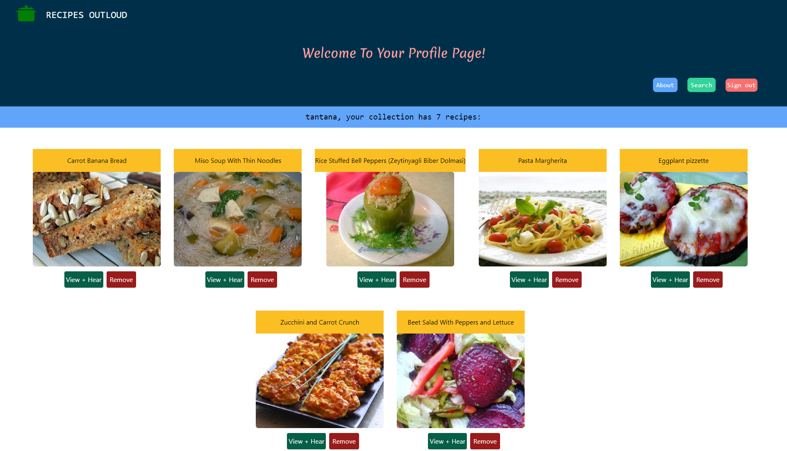
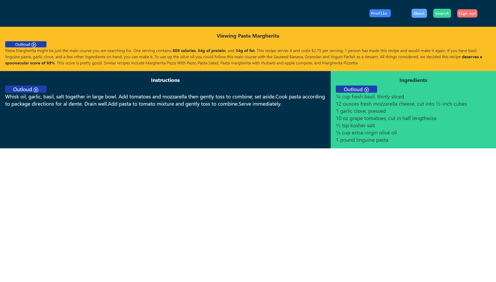

 

## **recipes outloud** 
 

[https://obscure-wave-54940.herokuapp.com/](https://obscure-wave-54940.herokuapp.com/) 

Project 3 - Team BABA 

Broc Crook, [https://github.com/bac5806](https://github.com/bac5806) 
Abner Toribio-Vazquez, [https://github.com/AbnerTor](https://github.com/AbnerTor) 
Brian McMullen, [https://github.com/MrBmmc](https://github.com/MrBmmc) 
Ali Aran, [https://github.com/AranATA](https://github.com/AranATA) 
 

## description

***
As an avid cook; I want to browse through recipes, set filters as my search options, create a collection of mine and listen to the instructions. Recipes Outloud aims to equip you with various tools to achieve this goal and make cooking more fun then ever! 
Recipes OutLoud App answers these needs and presents an easy to use interactive UI. The app was developed using the MERN stack with a React front end, MongoDB database, and Node.js/Express.js server and API. It also utilizes Tailwindcss at the front end and it's been set up to allow users to save recipe searches to the back end. All search data is sourced from Spoonacular API and React-Speech is used as the text to speech technology. The app was deployed to Heroku through MongoDB Atlas.  
 
 

## acceptance criteria

***

GIVEN Recipes OutLoud, the application: 

* MUST use GraphQL with a Node.js and Express.js server 
* MUST use MongoDB and the Mongoose ODM for the database 
* MUST use queries and mutations for retrieving, adding, updating, and deleting data 
* MUST be deployed using Heroku (with data) 
* MUST have a polished UI 
* MUST be interactive (i.e., accept and respond to user input) 
* MUST include authentication (JWT) 
* MUST protect sensitive API key information on the server 
* MUST have a high quality README file 
* MUST have a clean repository that meets quality coding standards 
* MUST look professional and be mobile-friendly 
 
 

## usage

***

Screenshot that shows the app's wireframe: 
 

 
 

Screenshots that show the fully generated web pages of the app: 
 

 
 

 
 

 
 

 
 

 
 
 

## some valuable references

***

These notes and links are listing some valuable references among others that we used doing this project: 
 

[https://www.apollographql.com/docs/react/local-state/local-state-management/](https://www.apollographql.com/docs/react/local-state/local-state-management/)

[https://www.apollographql.com/docs/apollo-server/security/authentication/](https://www.apollographql.com/docs/apollo-server/security/authentication/)

[https://www.howtographql.com/basics/1-graphql-is-the-better-rest/](https://www.howtographql.com/basics/1-graphql-is-the-better-rest/)

[https://graphql.org/blog/rest-api-graphql-wrapper/](https://graphql.org/blog/rest-api-graphql-wrapper/)

[https://www.mongodb.com/cloud/atlas](https://www.mongodb.com/cloud/atlas)

[https://blog.logrocket.com/how-react-hooks-can-replace-react-router/](https://blog.logrocket.com/how-react-hooks-can-replace-react-router/)

 
 

## credits

***

Stephen Woosley - Bootcamp Instructor 
Patrick Haberern - Bootcamp TA 
Tim Nagorski - Bootcamp TA 
Sean Walmer - Bootcamp TA 
 
 

## license

***

This is a project done under a bootcamp program.
 
 

## badges

***

 
 
